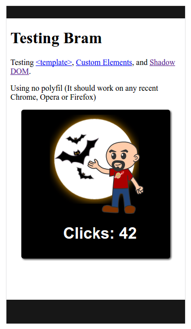
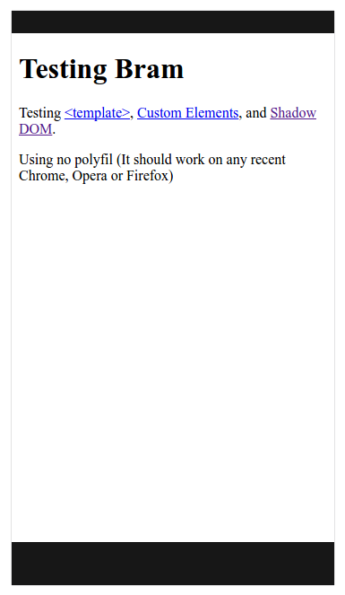
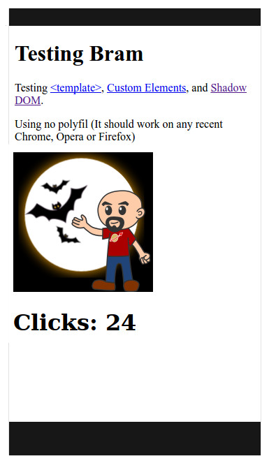

#Testing Bram, a new webcomponents library (I)


I’m always happy to discover new webcomponenents libraries, from people that have understood that it’s better to use the platform instead of writing a new framework yet.

So last night I was thrilled to learn about the latest one, Bram, thanks to the creator of the wonderful Skate.js, Trey Shugart.


<blockquote class="twitter-tweet" data-lang="en"><p lang="en" dir="ltr">Great to see more web component libraries popping up <a href="https://t.co/PvWhqsSNkP">bramjs.org</a> rather than reinventing the platform.</p>&mdash; Trey Shugart (@treshugart) <a href="https://twitter.com/treshugart/status/816777271365111808">January 4, 2017</a></blockquote>
<script async src="//platform.twitter.com/widgets.js" charset="utf-8"></script>


Going to their site, I found the pitch very interesting: 

> A simple 3kB web components library

The features looked promising too: a minimal layer on top of the native web component standards, with a declarative syntax for the templates and a tiny footprint.

But the only way to know if it fulfils  its promises is to test it, so I (foolishly) decided yet again to burn the midnight oil and code some components with Bram.

### Polyfills or not?

Bram is built over the v1 of Custom Elements, and Shadow DOM, and it use many ES6 syntax features, so if I wanted to test Bram without using polyfills the best way to do it is using a recent build of Chrome or Chromium. So I chose to do my first tests on a Chromium v.55 running on Ubuntu 16.10 (64-bit).

## Simple element ([`step-01`](./step-01))

The first test is simple: creating a custom element with Bram, using <template>, Shadow DOM and data binding. 
And here there was, a rather simple element that (unoriginally) I called simple-element:

```html
  <template id="simple-element-template">
    <style>
      :host {
        width: 300px;
        height: 300px;
        font-family: Arial, "Helvetica Neue", Helvetica, sans-serif;
        display: flex;
        flex-flow: column nowrap;
        justify-content: center;
        align-items: center;
        border-radius: 5px;
        color: white;
        background-color: black;
        box-shadow: 2px 2px 5px 0px rgba(0, 0, 0, 0.75);
      }      
      img {
        cursor: pointer;
      }
    </style>
    
    <h1>Clicks: {{count}}</h1>
  </template>
  <script>
    class SimpleElement extends Bram.Element {
      static get template() {
        return '#simple-element-template';
      }
    constructor() {
        super();
        this.model.count = 0;
      }
    handleClick() {
        this.model.count++;
      }
    }
    customElements.define('simple-element', SimpleElement);
  </script>
```

The code is rather clean and concise, and it reminds me of Polymer, in a very good way. As intended, it works without any polyfill on my Chrome test setup, but it doesn’t work neither in Firefox nor on Edge.

<br>
A HTML page with the simple-element on Chrome

<br>
The same page with the simple-element on Firefox

## Simple element with polyfills

The next step was to test the simple element with some polyfills.

### SkateJS Webcomponents polyfill ([`step-02`](./step-02))

First of all I tested SkateJS Webcomponents polyfill because its released version is compatible with the v.1 of Custom Elements and Shadow DOM, so I guessed it would work like a charm. 


Well, it kinda worked… I mean, everything worked besides the `<style>` inside the element, so I got an unstyled custom element:

<br>
A HTML page with SkateJS webcomponents polyfill and simple-element on Firefox


### webcomponents.js polyfill ([`step-03`](./step-03))

Then I tried to use the grand-daddy of all the webcomponents polyfills, webcomponents.js. The current version of this polyfill, v0.7.23, doesn’t follow the v.1 of Custom Elements and Shadow DOM, so I hadn’t big hopes on it, but I wanted to be sure.
As expected, with Firefox the custom element was simply ignored, and I got the classic error:

```
ReferenceError: customElements is not defined
```

Using it in Chrome went better, as everything worked... because Chrome already implements the v.1 of the standards so the polyfill doesn’t do anything. 

### Manually loading polyfills ([`step-04`](./step-04))

The next step was simply try to manually load all the needed polyfills.

I began by using custom-elements and shadydom polyfills, but I got the same result that with SkateJS Webcomponents polyfill, the inner CSS was ignored.

I was sure I’m missing something, but I had no idea of what yet… I guessed it was something CSS-related, so I tried to add yet another polyfill to the mix: shadycss. 

Some extra code lines are needed, in order to allow ShadyCSS to prepare the templates in browsers not supporting native shadow CSS:

```html
  <script>
    ShadyCSS.prepareTemplate(simpleElementTemplate, 'simple-element');
    class SimpleElement extends Bram.Element {
      static get template() {
        return '#simpleElementTemplate';
      }
    constructor() {
        super();
        ShadyCSS.applyStyle(this);
        this.model.count = 0;
      }
    handleClick() {
        this.model.count++;
      }
    }
    customElements.define('simple-element', SimpleElement);
  </script>
```

And then it worked!